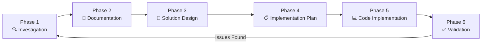

# docFlow v3.1

> AI Context Engineering Framework for Human-AI Collaboration

[](https://github.com/deacristi/docflow)
[](LICENSE)

## 🎯 What is docFlow?

**docFlow** is an AI Context Engineering Framework - a systematic approach to human-AI collaboration that ensures high-quality, production-ready code through structured documentation, context management, and template-driven development.

**Core Philosophy**: Manage AI context quality through **Research → Plan → Implement** workflow with proactive context monitoring, automated enforcement, and safe recovery protocols.

## 🆕 What's New in v3.1

| Feature | v3.0 | v3.1 |
|---------|------|------|
| Steering Rules | Basic | IDE-native integration (Kiro, Cursor, etc.) |
| Context Monitoring | Manual triggers | Automatic with configurable intervals |
| Checkpoint System | Concept | Full implementation with git integration |
| Freshness Checker | Concept | Working script with exit codes |
| Platform Support | Generic | Cross-platform (Windows/Mac/Linux) |

## 🏗️ Architecture

```
docFlow Framework v3.1
├── Layer 1: Philosophy (Research → Plan → Implement)
├── Layer 2: Process (6-phase workflow with gates)
├── Layer 3: Templates (Structured documentation)
├── Layer 4: Validation (Compliance checker)
├── Layer 5: Context Management (Dashboard + Steering Rules)
└── Layer 6: Recovery (Protocols + Checkpoint System)
```

## 📁 Repository Structure

```
docflow/
├── README.md                    # This file
├── LICENSE                      # MIT License
├── CHANGELOG.md                 # Version history
├── .gitignore                   # Git ignore patterns
├── docs/
│   ├── quickstart.md           # Quick start guide
│   ├── workflow_guide.md       # 6-phase workflow details
│   └── development_standards.md # Code standards and patterns
├── templates/
│   ├── implementation_plan.md  # Feature implementation planning
│   ├── issue_analysis.md       # Bug/issue root cause analysis
│   ├── feature_documentation.md # User-facing feature docs
│   ├── phase_gate_checklist.md # Phase gate reference
│   ├── recovery_protocols.md   # Recovery procedures
│   ├── service_template.py     # Python service pattern
│   └── tool_template.py        # AI tool pattern
├── scripts/
│   ├── checkpoint.py           # Development checkpoint system
│   └── check_freshness.py      # Living Code freshness checker
├── steering/
│   ├── context-monitoring.md   # AI context health rules
│   └── phase-gates.md          # Phase workflow enforcement
└── examples/
    └── living_code/            # Example Living Code structure
        ├── README.md           # Living Code explanation
        ├── MASTER_CONTEXT_LOADER.md  # AI entry point template
        └── patterns/
            ├── approved_patterns.md   # Patterns to use
            └── forbidden_patterns.md  # Anti-patterns to avoid
```

## 🚀 Quick Start

### 1. Copy to Your Project

```bash
# Clone docFlow
git clone https://github.com/deacristi/docflow.git

# Copy to your project
cp -r docflow/templates your-project/docs/templates
cp -r docflow/scripts your-project/scripts/docflow
cp -r docflow/steering your-project/.kiro/steering  # For Kiro IDE
# OR
cp -r docflow/steering your-project/.cursor/rules   # For Cursor
```

## 🔧 Adapting docFlow to Your Project

docFlow is designed to be project-agnostic. Follow these steps to customize it for any repository:

### Step 1: Customize Steering Rules

Edit `steering/context-monitoring.md`:
```markdown
## ⚠️ Critical Constraints (Customize for Your Project)

### Database Access
# Replace with YOUR project's database patterns
async with get_db() as session:  # Your pattern here

### Configuration
# Replace with YOUR project's config access
timeout = settings.API_TIMEOUT  # Your settings object
```

### Step 2: Customize Scripts

Edit `scripts/checkpoint.py`:
```python
# Update BACKUP_DIRS to match YOUR project structure
BACKUP_DIRS = [
    "docs/ai_context/living_code",  # Your context docs
    ".kiro/steering",                # Your steering rules
    "src/",                          # Your source code (optional)
]
```

Edit `scripts/check_freshness.py`:
```python
# Update paths to match YOUR project
DOCS_DIR = Path("docs/ai_context/living_code")  # Your docs location
SOURCE_DIRS = [
    Path("src"),   # Your source directories
    Path("app"),
    Path("lib"),
]
```

### Step 3: Create Living Code Context

Create your project's Living Code structure:
```
your-project/
└── docs/
    └── ai_context/
        └── living_code/
            ├── MASTER_CONTEXT_LOADER.md  # Copy from examples/
            ├── architecture/
            │   └── system_overview.md
            └── patterns/
                ├── approved_patterns.md
                └── forbidden_patterns.md
```

Customize `MASTER_CONTEXT_LOADER.md` with:
- Your project's architecture
- Your forbidden patterns
- Your current feature status
- Your development standards

### Step 4: Update Templates

Templates in `templates/` are ready to use. Customize:
- `implementation_plan.md` - Add your project-specific sections
- `issue_analysis.md` - Add your project's common issues
- `service_template.py` - Match your project's code style

### Step 5: Configure Your IDE

**Kiro IDE:**
```bash
cp -r steering/ your-project/.kiro/steering/
```

**Cursor:**
```bash
cp -r steering/ your-project/.cursor/rules/
```

**VS Code + Copilot:**
```bash
cat steering/*.md > your-project/.github/copilot-instructions.md
```

### Step 6: Add to .gitignore

```gitignore
# docFlow checkpoints
.docflow_checkpoints/
```

### Customization Checklist

- [ ] Updated `steering/context-monitoring.md` with your patterns
- [ ] Updated `steering/phase-gates.md` if needed
- [ ] Configured `scripts/checkpoint.py` backup directories
- [ ] Configured `scripts/check_freshness.py` paths
- [ ] Created `docs/ai_context/living_code/` structure
- [ ] Customized `MASTER_CONTEXT_LOADER.md` for your project
- [ ] Added `.docflow_checkpoints/` to `.gitignore`
- [ ] Copied steering rules to IDE config directory

### 2. Load Context at Session Start

Tell your AI assistant:
```
Load the docFlow framework from docs/templates/ and follow the 6-phase workflow.
```

### 3. Use Phase Gates

Before implementing, ensure you pass through the gates:
```
✅ Investigation complete. Proceeding to documentation.
✅ Documentation complete. Proceeding to solution design.
✅ Solution design complete. Proceeding to implementation planning.
✅ Implementation plan complete. Proceeding to code implementation.
✅ Implementation complete. Proceeding to validation.
```

### 4. Create Checkpoints Before Risky Changes

```bash
python scripts/checkpoint.py create pre-refactor "Before major refactoring"
python scripts/checkpoint.py list
python scripts/checkpoint.py restore pre-refactor  # If needed
```

## 📋 The 6-Phase Workflow



### Fast-Track for Simple Changes

For low-risk changes (< 20 lines, single file):
```
✅ Simple change verified. Implementing with validation.
```

## 🛠️ Key Components

### Steering Rules
AI instructions that enforce docFlow practices automatically. Place in your IDE's rules directory.

### Templates
Structured documents for consistent output:
- **Implementation Plan**: Plan before coding
- **Issue Analysis**: Understand before fixing
- **Feature Documentation**: Document for users

### Scripts
- **checkpoint.py**: Save/restore development state
- **check_freshness.py**: Detect stale documentation

### Recovery Protocols
Documented procedures for:
1. Context Degradation Recovery
2. Bad Implementation Rollback
3. Breaking Change Recovery
4. Scope Creep Recovery
5. Database/Migration Issues

## 📊 Benefits

| Metric | Without docFlow | With docFlow |
|--------|-----------------|--------------|
| Context Lifespan | 30-40 messages | 90-120 messages |
| Code Revisions | 40-50% | 15-20% |
| Accuracy | 80-85% | 95%+ |
| Time Savings | - | 90-180 min/week |

## 🔧 IDE Integration

### Kiro IDE
Copy steering rules to `.kiro/steering/`

### Cursor
Copy steering rules to `.cursor/rules/`

### VS Code + Copilot
Add to `.github/copilot-instructions.md`

### Other IDEs
Use steering rules as system prompts or AI instructions

## 📚 Documentation

- [Quick Start Guide](docs/quickstart.md)
- [Workflow Guide](docs/workflow_guide.md)
- [Development Standards](docs/development_standards.md)
- [Adaptation Guide](docs/adaptation_guide.md) - **How to adapt docFlow to any project**
- [Phase Gate Checklist](templates/phase_gate_checklist.md)
- [Recovery Protocols](templates/recovery_protocols.md)

## 🤝 Contributing

Contributions welcome! Please follow the docFlow workflow when contributing:
1. Create an issue analysis or feature specification
2. Follow the 6-phase workflow
3. Use the provided templates

## 📄 License

MIT License - See [LICENSE](LICENSE) for details.

---

**Version**: 3.1.0  
**Last Updated**: December 2025  
**Author**: [@deacristi](https://github.com/deacristi)
