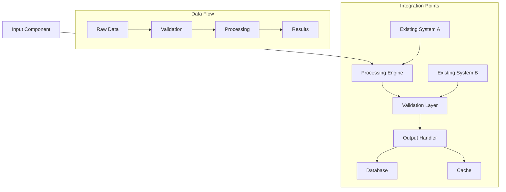
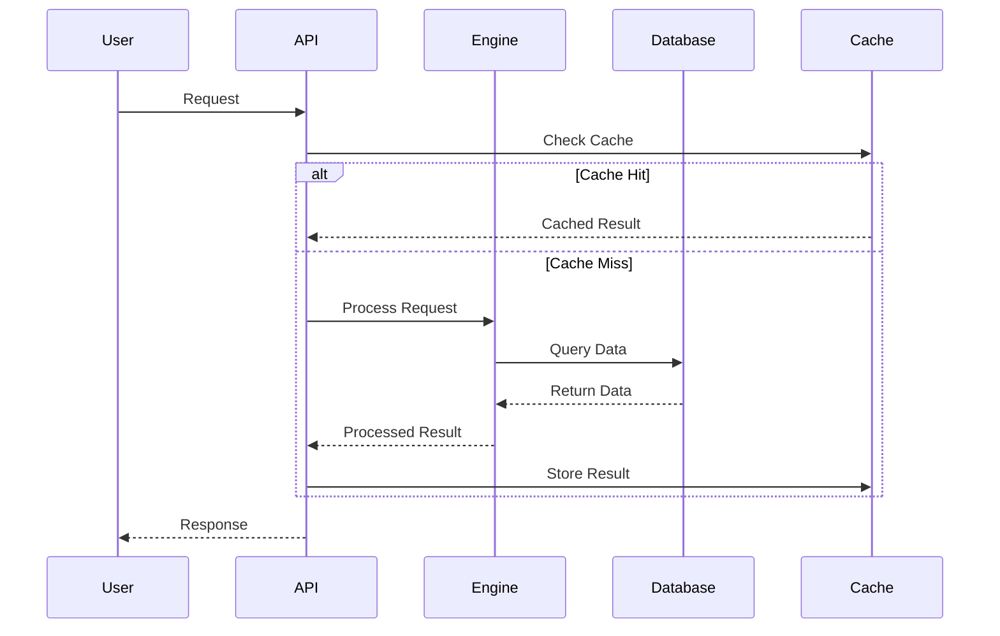

# [Feature Name] - Implementation Plan

**Feature ID**: [FEATURE_ID]  
**Priority**: [High/Medium/Low]  
**Estimated Effort**: [X-Y days]  
**Dependencies**: [List of dependencies]  
**Standards Reference**: `docs/development_standards.md`

---

## 🎯 **Implementation Overview**

### **Objective**
[Clear, concise description of what this feature accomplishes and why it's valuable for a solo day trader]

### **Success Criteria**
- [Measurable outcome 1]
- [Measurable outcome 2]
- [Measurable outcome 3]
- [Performance target with specific metrics]
- [User experience improvement]

### **Value Proposition for Day Trader**
[Specific explanation of how this feature improves trading performance, saves time, or increases profitability]

---

## 🏗️ **Architecture Overview**

### **For Senior Software Engineers**

#### **System Integration Points**
- **Existing Components**: [List components this feature integrates with]
- **New Components**: [List new components being created]
- **Data Flow**: [High-level data flow description]
- **Performance Requirements**: [Specific latency/throughput requirements]

#### **Technical Design Decisions**
1. **[Decision 1]**: [Rationale and trade-offs]
2. **[Decision 2]**: [Rationale and trade-offs]
3. **[Decision 3]**: [Rationale and trade-offs]

### **For Junior Software Engineers**

#### **What We're Building**
[Simple, clear explanation of the feature in non-technical terms]

#### **Key Concepts**
1. **[Concept 1]**: [Simple explanation with analogy if helpful]
2. **[Concept 2]**: [Simple explanation with analogy if helpful]
3. **[Concept 3]**: [Simple explanation with analogy if helpful]

#### **Architecture Diagram**


#### **Sequence Diagram**


---

## 📋 **Implementation Phases**

### **Phase 1: Foundation Setup ([X] days)**

#### **Tasks**
1. **Configuration Setup** ([X] hours)
   - Add configuration values to `config_specification.yaml`
   - Update `app/core/config.py` with new properties
   - Validate configuration loading

2. **Database Schema** ([X] hours)
   - Create migration files
   - Add new tables/columns
   - Update models

3. **Base Classes** ([X] hours)
   - Implement base classes following TradePulse patterns
   - Add input/output validation
   - Set up error handling

#### **Deliverables**
- [ ] Configuration values externalized
- [ ] Database schema updated
- [ ] Base classes implemented
- [ ] Unit tests for foundation components

### **Phase 2: Core Implementation ([X] days)**

#### **Tasks**
1. **Main Engine** ([X] hours)
   - Implement core processing logic
   - Add performance monitoring
   - Integrate with existing systems

2. **API Integration** ([X] hours)
   - Create API endpoints
   - Add request/response validation
   - Implement error handling

3. **Caching Layer** ([X] hours)
   - Implement intelligent caching
   - Add cache invalidation logic
   - Performance optimization

#### **Deliverables**
- [ ] Core engine implemented
- [ ] API endpoints functional
- [ ] Caching system operational
- [ ] Integration tests passing

### **Phase 3: Testing & Optimization ([X] days)**

#### **Tasks**
1. **Comprehensive Testing** ([X] hours)
   - Unit test coverage >90%
   - Integration test scenarios
   - Performance benchmarking

2. **Performance Optimization** ([X] hours)
   - Profile critical paths
   - Optimize database queries
   - Tune cache strategies

3. **Documentation** ([X] hours)
   - API documentation
   - User guides
   - Troubleshooting guides

#### **Deliverables**
- [ ] Test coverage >90%
- [ ] Performance targets met
- [ ] Documentation complete
- [ ] Production readiness validated

---

## 🔧 **Configuration Specification**

### **config_specification.yaml Updates**
```yaml
[feature_name]:
  # Core settings
  enabled: true
  timeout_seconds: [X]
  max_concurrent_operations: [X]
  
  # Performance settings
  cache_ttl_seconds: [X]
  batch_size: [X]
  retry_attempts: [X]
  
  # Business logic settings
  confidence_threshold: [X]
  quality_threshold: [X]
  
  # Integration settings
  external_api_timeout: [X]
  database_timeout: [X]
```

---

## 🧪 **Testing Strategy**

### **Test Scenarios**
1. **Happy Path**: [Description of normal operation test]
2. **Edge Cases**: [Description of boundary condition tests]
3. **Error Conditions**: [Description of error handling tests]
4. **Performance Tests**: [Description of load/stress tests]

### **Validation Criteria**
- [ ] All unit tests pass
- [ ] Integration tests pass
- [ ] Performance meets targets
- [ ] Error handling works correctly
- [ ] Configuration validation works
- [ ] Cache behavior is correct

### **Manual Testing Checklist**
- [ ] Feature works end-to-end
- [ ] UI/API responses are correct
- [ ] Error messages are helpful
- [ ] Performance is acceptable
- [ ] Integration with existing features works

---

## 📊 **Expected Outcomes**

### **For Day Traders**
- **Immediate Benefits**: [Specific trading improvements]
- **Time Savings**: [Quantified time savings]
- **Performance Improvement**: [Expected performance gains]
- **Risk Reduction**: [How this reduces trading risks]

### **Technical Metrics**
- **Response Time**: [Target response time]
- **Accuracy**: [Expected accuracy percentage]
- **Reliability**: [Uptime/error rate targets]
- **Scalability**: [Capacity improvements]

### **Business Value**
- **Annual Value**: [Estimated annual value in dollars]
- **ROI**: [Return on implementation investment]
- **Competitive Advantage**: [How this differentiates TradePulse]

---

## ✅ **Implementation Checklist**

### **Pre-Implementation**
- [ ] Requirements clearly defined
- [ ] Dependencies identified and available
- [ ] Configuration values planned
- [ ] Test scenarios documented
- [ ] Performance targets set

### **During Implementation**
- [ ] Follow TradePulse development standards
- [ ] All magic numbers in configuration
- [ ] Proper error handling implemented
- [ ] Performance monitoring added
- [ ] Unit tests written alongside code

### **Post-Implementation**
- [ ] All tests passing
- [ ] Performance targets met
- [ ] Documentation updated
- [ ] Code review completed
- [ ] Production deployment successful

---

## 🚀 **Production Readiness**

### **Deployment Requirements**
- [ ] Configuration validated
- [ ] Database migrations tested
- [ ] Performance benchmarks met
- [ ] Error handling verified
- [ ] Monitoring alerts configured

### **Success Validation**
After implementation, validate success by:
1. **Functional Testing**: [Specific tests to run]
2. **Performance Testing**: [Specific metrics to measure]
3. **User Acceptance**: [Specific user scenarios to validate]
4. **Integration Testing**: [Specific integration points to verify]

---

*Implementation Plan prepared according to TradePulse v4.0 Development Standards*
