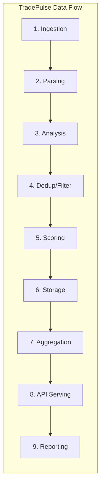
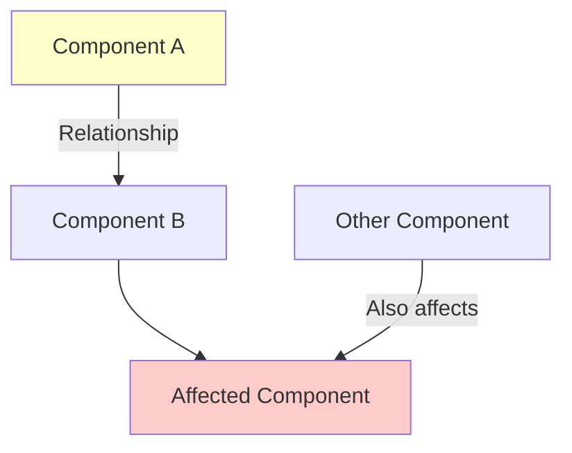
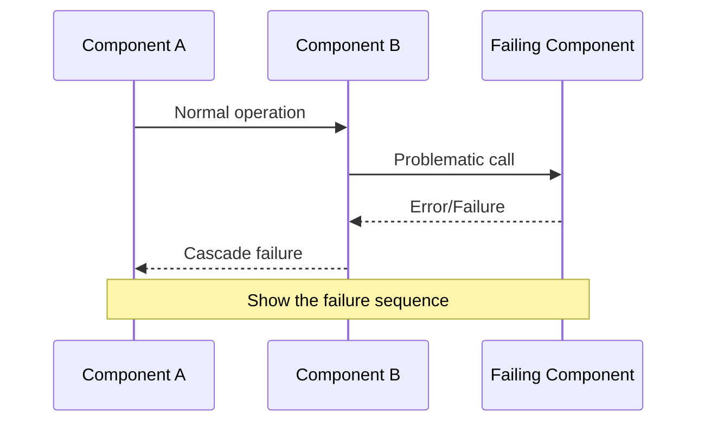
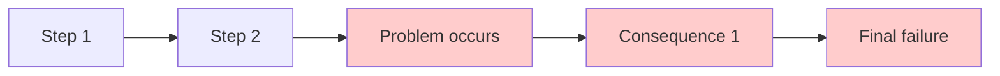
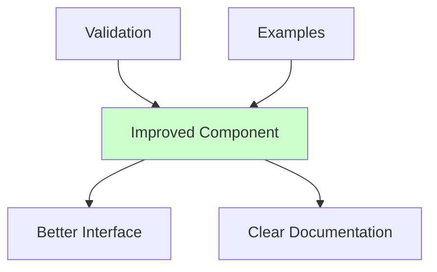
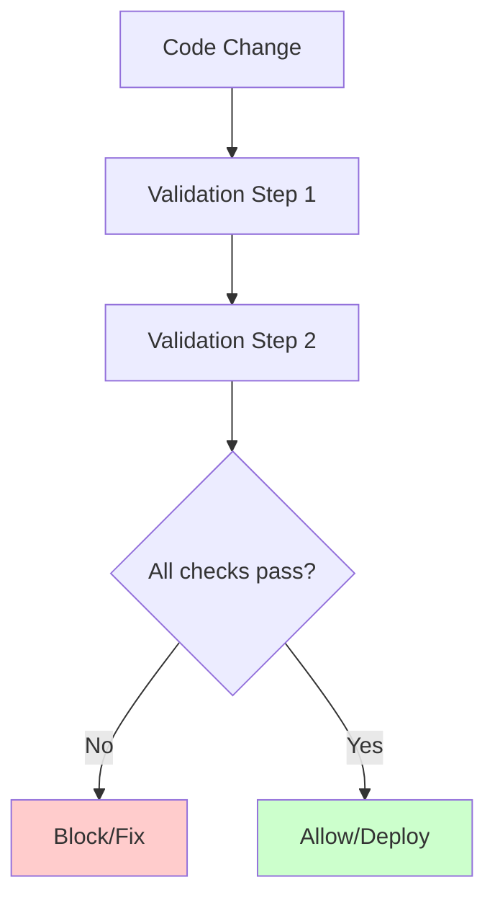
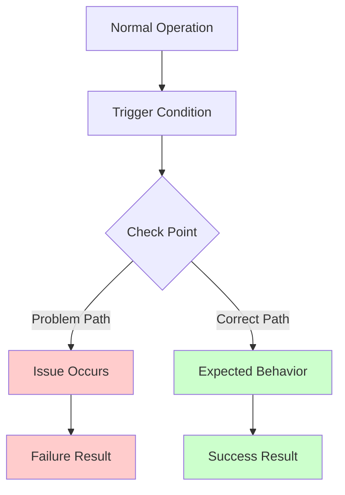

# [Issue Title] - Root Cause Analysis Report

**Issue ID**: [ISSUE_ID]  
**Severity**: [Critical/High/Medium/Low]  
**Discovery Date**: [YYYY-MM-DD]  
**Reporter**: [Name/Role]  
**Status**: [Identified/In Progress/Resolved]  
**File Naming Convention**: `[issue_id]_[issue_description]_[year_month].md` (e.g., `ISSUE-123_api_latency_spike_2025_11.md`)

---

## 🎯 **Executive Summary**

### **Issue Description**
[Clear, concise description of what went wrong and how it manifests]

### **Impact Assessment**
- **Immediate**: [What fails right now]
- **Scope**: [How many components/files affected]
- **Business Impact**: [Effect on trading operations/system functionality]

### **Root Cause Summary**
[One-sentence summary of the fundamental cause]

---

## 📋 **Plain-Language Summary**

> *This section provides a non-technical breakdown of the issue: what went wrong in simple terms, where it sits in the data pipeline, and what type of problem it is. This helps all team members (including future reviewers) quickly understand scope and context without reading the full technical analysis.*

| Aspect | Description |
|--------|-------------|
| **What went wrong (simple)** | [One-sentence explanation a non-engineer could understand. Example: "The system treats the word 'CEO' as a stock ticker and stores it as a real trading symbol."] |
| **Where in the pipeline** | [Which stage(s) of the TradePulse data flow are affected. Example: "Stage 1 — Ingestion & Extraction. The symbol extractor has no validation gate."] |
| **What type of problem** | [Classify: functional bug, data quality bug, feature gap, performance issue, terminology inconsistency, orphaned schema, error handling anti-pattern, etc.] |
| **Why it matters** | [Business impact in plain terms. Example: "7.4M database rows are polluted with fake ticker data, making social sentiment analysis unreliable."] |

### **Issue Map on the Data Flow**

> *Show where this issue sits in the TradePulse 9-stage data flow. Highlight the affected stage(s) in color.*



> **Instructions:** Uncomment and modify the `style` lines to highlight affected stages. Use amber for "affected", red for "bug location", green for "fix location". Replace the generic diagram with a more detailed one showing specific components if applicable (e.g., show the specific service/function where the bug occurs).

---

## �🔍 **Detailed Root Cause Analysis**

### **Technical Root Cause**

[Detailed technical explanation of why the issue occurred, including:]
1. **Expected Behavior**: [What should happen]
2. **Actual Behavior**: [What actually happens]
3. **Fundamental Mismatch**: [Core technical reason for failure]

### **Code Analysis**

**Current Implementation**:
```python
# Show relevant code that demonstrates the issue
```

**Problematic Usage**:
```python
# Show code that triggers the problem
```

**Correct Implementation Should Be**:
```python
# Show what the correct code should look like
```

---

## 📊 **Architecture Impact Analysis**

### **Affected Components**



### **Data/Control Flow Analysis**



### **TradePulse Architecture Impact**

**Affected Layers**:
1. **[Layer 1]**: [How this layer is affected]
2. **[Layer 2]**: [How this layer is affected]
3. **[Layer 3]**: [How this layer is affected]

**Ripple Effects**:
- [Effect 1]
- [Effect 2]
- [Effect 3]

---

## 📚 **Development Standards Compliance Analysis**

### **Standards Violations Identified**

Reviewing `docs/development_standards.md`:

#### **1. [Standard Category] (VIOLATED/PARTIALLY VIOLATED)**
- **Standard**: "[Quote from standards document]"
- **Violation**: [How this standard was violated]
- **Impact**: [What happened because of this violation]

#### **2. [Another Standard Category] (VIOLATED/PARTIALLY VIOLATED)**
- **Standard**: "[Quote from standards document]"
- **Violation**: [How this standard was violated]
- **Impact**: [What happened because of this violation]

### **Specific Standards Recommendations Not Followed**

```python
# From standards document - show relevant code example
```

**Missing**: [What was missing that should have been implemented according to standards]

---

## 👨‍💻 **Junior Engineer Explanation**

### **What Happened?**

[Use a simple analogy to explain the issue. Examples:]
- Building/construction analogy
- Kitchen/cooking analogy
- Transportation analogy
- Everyday object analogy

### **In Programming Terms**

1. **[Concept 1]**: [Simple explanation]
2. **[Concept 2]**: [Simple explanation]
3. **[Concept 3]**: [Simple explanation]

### **The Problem Chain**



### **Why This Happened**

1. **[Reason 1]**: [Explanation]
2. **[Reason 2]**: [Explanation]
3. **[Reason 3]**: [Explanation]

---

## 🛠️ **MCP Tools for Prevention**

### **Recommended MCP Tools for Solo Development**

1. **[Tool Name] MCP**
   - **Purpose**: [What this tool does]
   - **Usage**: [How to use it]
   - **Prevention**: [How it prevents this issue]
   - **VS Code Integration**: [How to integrate with VS Code]

2. **[Another Tool] MCP**
   - **Purpose**: [What this tool does]
   - **Usage**: [How to use it]
   - **Prevention**: [How it prevents this issue]

### **VS Code Integration Setup**

```json
// .vscode/settings.json
{
  "setting1": "value1",
  "setting2": "value2"
}
```

### **Automated Validation Script**

```python
# scripts/validate_[issue_type].py
def check_for_issue():
    """Script to automatically detect this type of issue"""
    # Implementation
    pass
```

---

## 🏗️ **Architecture Improvement Recommendations**

### **1. [Improvement Area] Design**



### **2. Enhanced Development Standards**

**Add to Development Standards**:

```markdown
## [New Section Title]

### [Subsection]
1. **[Rule 1]**: [Description]
2. **[Rule 2]**: [Description]

### [Another Subsection]
- [Requirement 1]
- [Requirement 2]
```

### **3. Automated Validation Pipeline**



---

## 📈 **Prevention Strategy**

### **Immediate Actions**
1. **[Action 1]**: [Description and timeline]
2. **[Action 2]**: [Description and timeline]
3. **[Action 3]**: [Description and timeline]

### **Long-term Improvements**
1. **[Improvement 1]**: [Description]
2. **[Improvement 2]**: [Description]
3. **[Improvement 3]**: [Description]

### **Standards Updates**

**Add to Development Standards**:
```markdown
## [New Standards Section]

### [Category]
1. **[Rule]**: [Description]
2. **[Rule]**: [Description]

### [Validation Requirements]
- [Requirement 1]
- [Requirement 2]
```

---

## 🔄 **[Issue Type] Flow Diagram**



## 🎯 **Lessons Learned**

### **For Development Process**
- [Lesson 1]
- [Lesson 2]
- [Lesson 3]

### **For Architecture**
- [Lesson 1]
- [Lesson 2]
- [Lesson 3]

### **For Standards**
- [Lesson 1]
- [Lesson 2]
- [Lesson 3]

---

## 📋 **Action Items**

### **Immediate (Next 24 hours)**
- [ ] [Action item 1]
- [ ] [Action item 2]
- [ ] [Action item 3]

### **Short-term (Next week)**
- [ ] [Action item 1]
- [ ] [Action item 2]
- [ ] [Action item 3]

### **Long-term (Next month)**
- [ ] [Action item 1]
- [ ] [Action item 2]
- [ ] [Action item 3]

---

## 📚 **References**

- [TradePulse Development Standards](../development_standards.md)
- [Implementation Plan](../implementation_plans/[related_plan].md)
- [Related Documentation]
- [External Resources]
